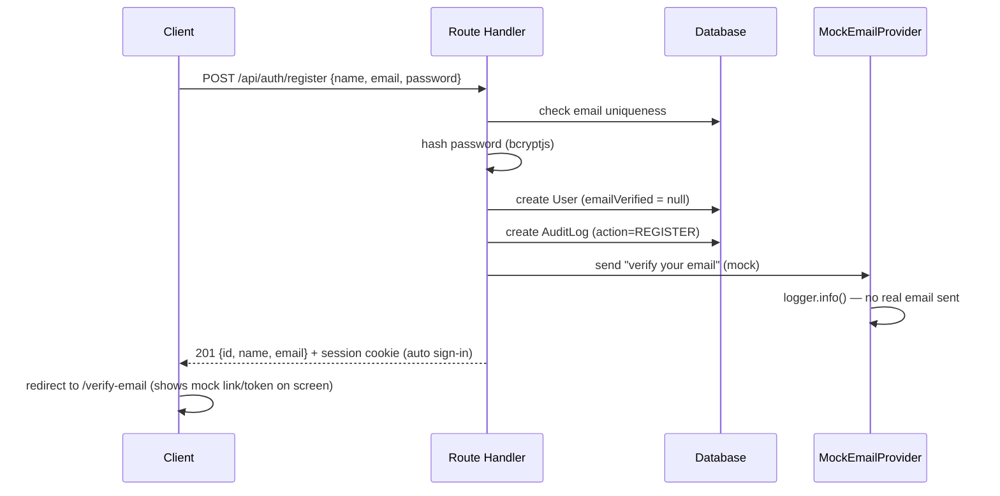
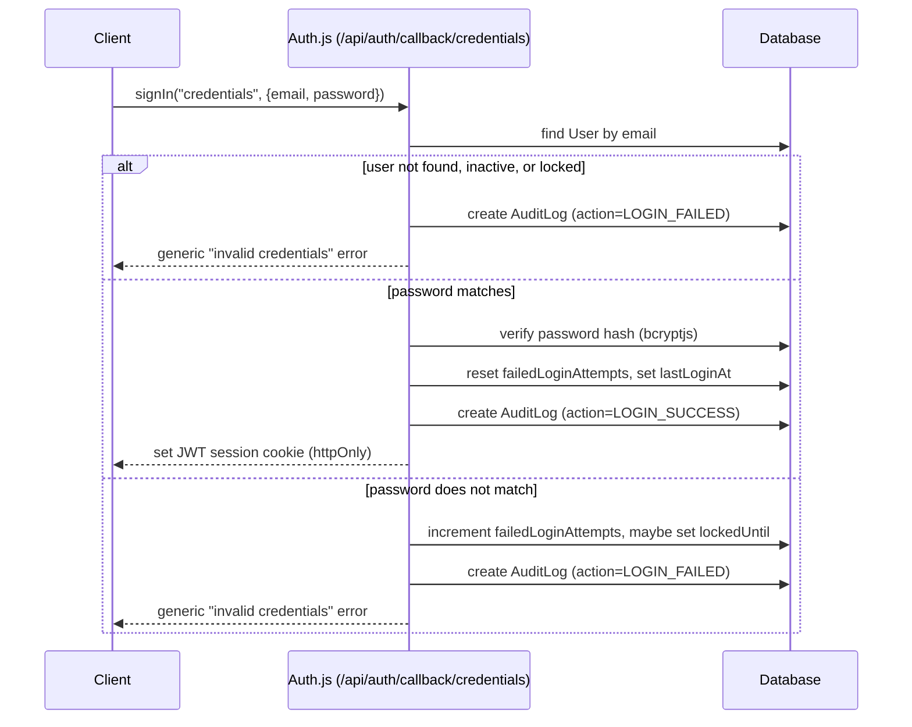
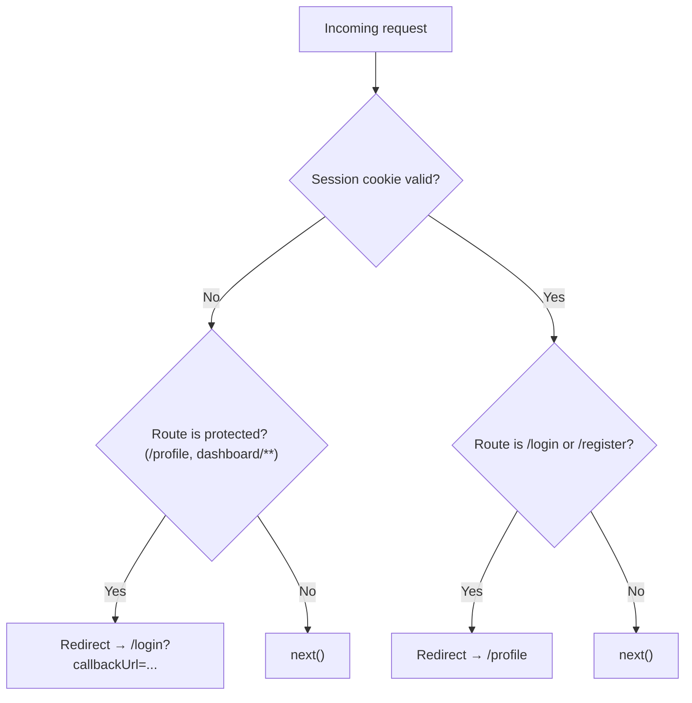
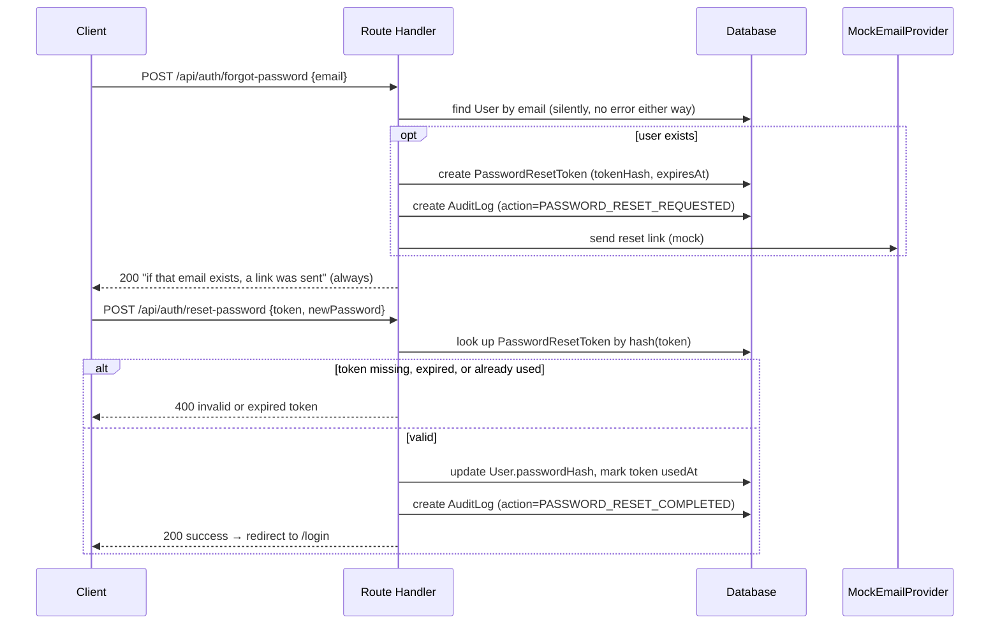
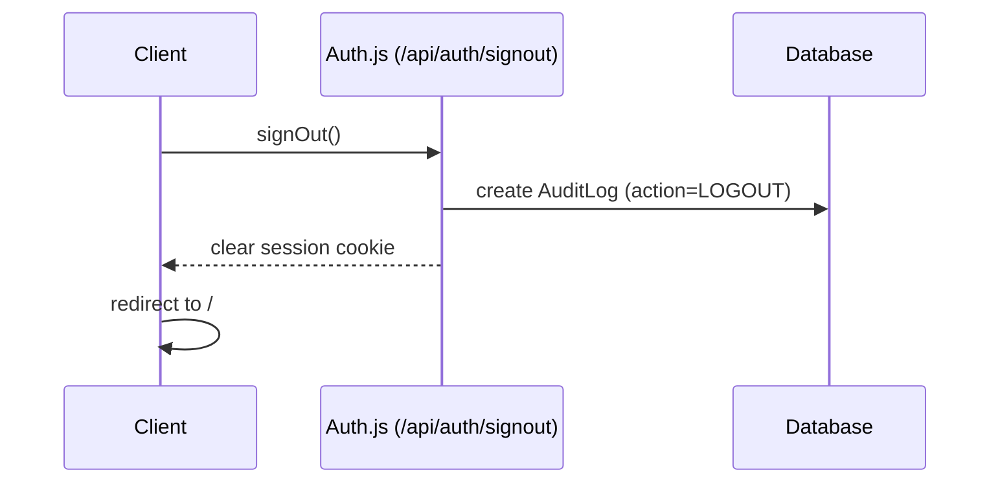

# Authentication Flow

Diagrams for the flows implemented in Milestone 2 (Identity & Access
Management). These are the flows the plan in `docs/session-log.md`
describes in prose — this file is the visual reference.

## Register → Mock Email Verification

## Login (Credentials)

## Route Protection (Middleware)

## Forgot Password → Reset Password

## Logout

